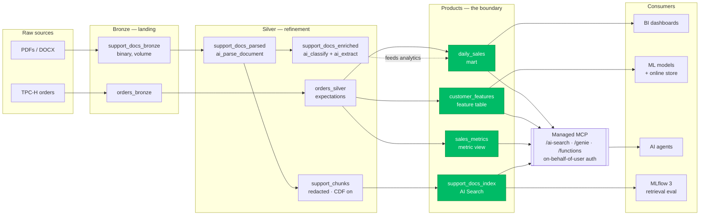

# The AI Consumption Plane on Databricks

End-to-end, runnable source for an **AI consumption plane** on Databricks: one Bronze → Silver refinement flow that terminates in four governed data products (analytical mart, feature set, vector index, metric view), exposes them to AI agents through Databricks managed MCP servers, and closes the loop with measured retrieval quality. Every object — volumes, tables, feature tables, index, metric view, functions, MCP endpoints — lives under one Unity Catalog permission and lineage model.

## Architecture



## Prerequisites

- Databricks workspace with **Unity Catalog** enabled, permissions to create catalogs/schemas/volumes, pipelines, AI Search endpoints, and SQL functions.
- **DBR 17.3+** or **serverless environment version 3+** (required by `ai_parse_document`; region-dependent — check [AI function availability](https://docs.databricks.com/aws/en/sql/language-manual/functions/ai_parse_document)). **DBR 18.2+** only if you flip `config.USE_AI_PREP_SEARCH = True` (the Beta chunker) — the deterministic default runs on any supported runtime.
- Access to the `samples` catalog (TPC-H sample data) — enabled by default in most workspaces.
- For the optional online store: `databricks-feature-engineering >= 0.13.0` and a Lakebase-enabled workspace.
- Python libs are installed per-notebook via `%pip` magics; `requirements.txt` mirrors them for local IDEs. The AI Search SDK is auto-selected by `lib/ai_search.py` (`databricks-ai-search`/`AISearchClient`, falling back to legacy `databricks-vectorsearch`).

## Quickstart — run in order

| Step | File | What it does |
|---|---|---|
| 1 | `00_setup/01_namespace.sql` | Catalog `eshop`, schemas `bronze/silver/products`, docs volume |
| 2 | `00_setup/02_generate_sample_docs.py` | Writes 4 synthetic PDFs (policies, FAQ, warranty, complaint with planted PII) into the volume |
| 3 | `01_pipeline/{bronze,silver_orders,silver_docs}.py` | Create a **Lakeflow Spark Declarative Pipeline** whose source is this folder (UI: *Pipelines → Create → add the three `.py` files*; serverless recommended; default catalog `eshop`, target schema `silver`). Run it. Optional: `databricks bundle deploy` using `databricks.yml`. |
| 3b | `01_pipeline/event_log_quality.sql` | *After a pipeline run* — query expectation pass/fail counts from the event log; publishes a governed quality view |
| 3c | `01_pipeline/monitoring_alerts.sql` | *Ops* — queries to wire as Databricks SQL Alerts (expectation failures, parse errors, index staleness, canary) |
| 4 | `02_products/01_daily_sales_mart.sql` | Materialized-view mart |
| 5 | `02_products/02_customer_features.py` | Unity Catalog feature table (idempotent create + merge) |
| 5b | `02_products/02b_online_feature_store.py` | *Optional* — publish features to a Lakebase online store (offline **and** online) |
| 6 | `02_products/03_vector_index.py` | AI Search endpoint + Delta Sync index (waits until ready, cited smoke query) |
| 7 | `02_products/04_sales_metric_view.sql` | Metric view with agent metadata (synonyms) + `MEASURE()` check |
| 8 | `03_agents/01_lookup_function.sql` | UC function agent tool (returns a JSON feature row) |
| 8b | `03_agents/04_grants.sql` | Grant the agent group its tools — the entire agent security model |
| 9 | `03_agents/02_genie_space.md` *(or `06_create_genie_space.py`)* | Create the Genie Space — UI steps, or as-code best-effort; paste `space_id` into `config.py` |
| 10 | `03_agents/03_mcp_smoke_test.py` | Verifies assets and prints your three managed-MCP URLs |
| 10b | `03_agents/05_mcp_client_example.py` | The whole consumer side — connect an agent to a managed MCP server (~10 lines) |
| 11 | `04_evaluation/retrieval_eval.py` | Hit-rate HYBRID vs ANN + MLflow `RetrievalGroundedness` over real LLM answers; fails below quality thresholds |
| 12 | `05_verify_and_cleanup/verify.py` | One-shot health check of every stage |
| 12b | `05_verify_and_cleanup/delete_document.py` | *Ops* — right-to-be-forgotten: purge a doc's chunks, sync the index, assert it's gone |
| 13 | `05_verify_and_cleanup/teardown.py` | Deletes index/endpoint/online store and drops schemas (**stops all costs**) |

The Silver docs pipeline (`01_pipeline/silver_docs.py`) runs **parse → enrich → chunk**: it parses with `ai_parse_document(content, map('version','2.0'))`, and (with `config.ENABLE_ENRICHMENT = True`, the default) emits `silver.support_docs_enriched` via `ai_classify` + `ai_extract` — one structured row per document (classification + extracted fields) that feeds analytics alongside the retrieval chunks.

All names live in **`config.py`** — edit once, everything follows.

## Develop & test locally

No workspace needed for the fast feedback loop:

```bash
make install     # dev dependencies
make hooks       # optional: pre-commit gates on every commit
make check       # lint + compile + tests (everything CI runs)
make lock        # optional: pin exact runtime versions -> requirements.lock (needs uv)
make validate    # optional: validate the Asset Bundle (dev)
```

`make help` lists all targets. The same checks run in CI on every push (`.github/workflows/ci.yml`); `make deploy-{dev,staging,prod}` deploys the bundle.

## Deployment & operations

- **Multi-environment bundle.** `databricks.yml` defines `dev` / `staging` / `prod` targets (distinct catalogs), a scheduled refresh **job** (`refresh_cron`, default 06:00 UTC), and pipeline/job **failure notifications** (`notification_email`). Deploy with `databricks bundle deploy -t prod`. Set `run_as` to a service principal in shared environments.
- **CI gates.** `ci.yml` (lint · compile · tests · `bundle validate`) runs on every push; `eval.yml` runs the retrieval evaluation **nightly and fails on regression** below `EVAL_MIN_HIT_RATE` / `EVAL_MIN_GROUNDEDNESS`. Both self-skip until you add `DATABRICKS_HOST` / `DATABRICKS_TOKEN` repo secrets (OIDC preferred).
- **Config safety.** `config.validate()` runs at the top of every entrypoint — a bad enum, empty name, or nonsensical chunk size fails immediately, not 30 minutes into an index build.
- **Idempotency & resilience.** Existence is checked explicitly (`list_*`, `tableExists`, `get_online_store`) rather than by matching error strings; long waits use capped exponential backoff (`lib/retry.py`).
- **Monitoring.** Wire the queries in `01_pipeline/monitoring_alerts.sql` as Databricks SQL Alerts (expectation failures, parse errors, index staleness, empty-retrieval canary).
- **Deletion / RTBF.** `05_verify_and_cleanup/delete_document.py` purges a document's chunks in Silver, syncs the index, and asserts it's no longer retrievable — test it before the first legal request.
- **Secrets.** Runtime credentials come from a Databricks secret scope via `lib/secrets.py` (env-var fallback for CI), never from `config.py`.

## Design decisions (read before running)

- **Both chunk paths, one column contract.** `ai_prep_search` is Beta (and needs DBR 18.2+), so `config.USE_AI_PREP_SEARCH = False` by default: the pipeline uses a deterministic manual chunker (page-aware element walker + overlapping windows). Either path emits the **same columns** — `chunk_id`, `chunk_content`, `chunk_to_embed`, `chunk_position`, `source_uri`, `path` — so the index config never changes. Flip the flag for the platform-native path (`variant_explode` over `document.contents[]`, per the [IDP docs](https://docs.databricks.com/aws/en/agents/agent-bricks/intelligent-document-processing)).
- **The index embeds `chunk_to_embed`, not raw text.** That's the context-enriched column (title + chunk); `chunk_content` is kept separately for display/citations.
- **Citations are first-class.** `source_uri` + `chunk_position` travel with every chunk, so RAG answers can cite *"the return policy, page 1"* — the smoke query and the MLflow retriever both surface them.
- **Pure logic is unit-tested.** The chunking/redaction algorithm lives in `lib/chunking.py` (no Spark imports) and is covered by `tests/test_chunking.py`; `silver_docs.py` inlines the same logic to stay runnable inside Lakeflow. CI (`.github/workflows/ci.yml`) runs ruff, `compileall`, and the tests on every push.
- **PII is redacted in Silver, before embedding — on both chunk paths.** `config.PII_ENGINE` selects `regex` (baseline email/phone) or native `ai_mask` (production; masks person/address/etc.). The manual *and* `ai_prep_search` paths both pass through redaction, so raw personal data never enters an embedding. See `lib/pii.py` and [`SECURITY.md`](SECURITY.md).
- **Parse failures never reach retrieval.** Both chunk paths filter rows where `parsed:error_status` is set.
- **Idempotent by construction.** `IF NOT EXISTS` / `CREATE OR REPLACE` and content-addressable `chunk_id`s everywhere; re-running any step is safe.
- **Managed embeddings** (`databricks-qwen3-embedding-0-6b`, the current recommended model; `databricks-gte-large-en` still works) — required by the managed MCP AI Search server.
- **SDK-agnostic.** `lib/ai_search.py` prefers the current `AISearchClient` and falls back to the legacy `VectorSearchClient`, so the build runs on either.

## Cost notes

The vector search **endpoint** and any **online feature store** bill while they exist — run `05_verify_and_cleanup/teardown.py` when done. The AI functions (`ai_parse_document`, and `ai_classify`/`ai_extract` when `ENABLE_ENRICHMENT`, and `ai_mask` when `PII_ENGINE="ai_mask"`) bill under the `AI_FUNCTIONS` product; the 4 sample PDFs cost pennies.

## Repository layout

- `00_setup` — Unity Catalog namespace + synthetic sample documents
- `01_pipeline` — Lakeflow pipeline (Bronze + Silver), the data-quality event-log query, and monitoring/alert SQL
- `02_products` — the four data products: mart, feature set (offline + online store), vector index, metric view
- `03_agents` — agent tools: UC function, grants, Genie space (UI + as-code), managed-MCP smoke test + client
- `04_evaluation` — retrieval quality: hit-rate tuning + MLflow groundedness with regression thresholds
- `05_verify_and_cleanup` — health check, right-to-be-forgotten deletion path, cost teardown
- `lib` — pure, unit-tested helpers: chunking, PII redaction, AI Search client factory, retry/backoff, secrets
- `tests` / `.github` — unit tests (chunking, config, pii, retry) and CI (`ci.yml` gate + nightly `eval.yml` regression), CODEOWNERS, PR template
- `config.py` · `databricks.yml` · `Makefile` · `.pre-commit-config.yaml` · `pyproject.toml` — config, multi-env bundle, dev/ops targets, hooks, tooling
- `SECURITY.md` · `CHANGELOG.md` · `LICENSE` — security model, history, license

## Production hardening

Much of the hardening is already built in:

- **Fail-fast config** — `config.validate()` runs at the top of every entrypoint (bad enum / empty name / nonsensical chunk size fails immediately).
- **Robust idempotency & resilience** — explicit existence checks (`list_*`, `tableExists`, `get_online_store`) instead of error-string matching; index-readiness waits use typed status + capped backoff (`lib/retry.py`).
- **PII redaction on both chunk paths** — `config.PII_ENGINE` = `regex` (baseline) or native `ai_mask` (production); nothing raw reaches an embedding. See `lib/pii.py` and [`SECURITY.md`](SECURITY.md).
- **Tested right-to-be-forgotten** — `05_verify_and_cleanup/delete_document.py` purges chunks, syncs the index, and asserts the doc is gone.
- **Multi-environment deploy** — `databricks.yml` `dev`/`staging`/`prod` targets, a scheduled refresh job, and failure notifications.
- **CI gates** — `ci.yml` (lint · compile · tests · `bundle validate`) plus nightly `eval.yml` that fails on retrieval regression.
- **Monitoring** — `01_pipeline/monitoring_alerts.sql` to wire as SQL Alerts; **pre-commit** (ruff + gitleaks) blocks secrets before they land.

What still needs **your environment** (config/credentials, not code):

- **Add repo secrets** — `DATABRICKS_HOST` + OIDC federation (or `DATABRICKS_TOKEN`); until then both CI jobs self-skip.
- **Verify & lock dependencies** — some packages/models track the newest Databricks surface (`databricks-ai-search`, `databricks-mcp`, `databricks-qwen3-embedding-0-6b`, `databricks-claude-sonnet-4-6`). Confirm availability in your workspace/region, then `make lock`.
- **Turn on production PII** — set `PII_ENGINE = "ai_mask"` and eyeball masked output on real documents (default `regex` avoids token cost).
- **Beta functions** — validate `ai_prep_search` (DBR 18.2+) / v2 `ai_extract` output before flipping `USE_AI_PREP_SEARCH`. The deterministic manual chunker is the safe default.
- **Set real values** — `notification_email`, `run_as` service principal, prod catalog names, secret scope; scope `03_agents/04_grants.sql` to real groups; enable the `TIMESERIES` primary-key designation for point-in-time-correct training joins.
- **Replace synthetic ingestion** — `00_setup/02_generate_sample_docs.py` stands in for real arrival; point Auto Loader at your source.

## License

MIT — see `LICENSE`.
